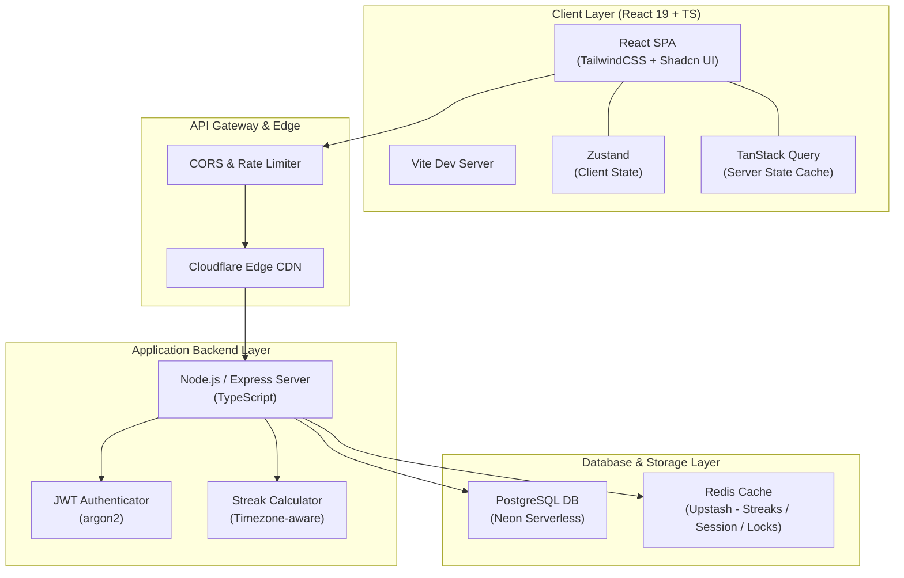

# CareerLift — Product Architecture & Implementation Specification

CareerLift is an interactive web platform designed to make job candidates interview-ready every day through byte-sized daily practice, community-sourced company interview databases, and gamified streak achievements. 

This document serves as the complete technical implementation and planning specification, translating the **Frontend Functional Specification (FSD)** into an executable architecture, database schema, API contracts, project structures, and a phased delivery roadmap.

---

## 1. High-Level System Architecture

CareerLift is built with a decoupled client-server architecture. The frontend focuses on high performance, micro-interactions, and a mobile-first user experience. The backend services user progression, content delivery, and crowd-sourced submissions.



---

## 2. Technology Stack

### Frontend Stack (Core FSD)
* **Core:** React 19 (React's latest concurrent rendering and performance features)
* **Build System:** Vite (lightning-fast Hot Module Replacement)
* **Language:** TypeScript (strict type safety)
* **Routing:** React Router v7 (declarative route configurations)
* **State Management:** 
  * **Zustand:** Lightweight global UI state (auth tokens, user settings, active filters).
  * **TanStack Query (v5):** Server state caching, optimistic updates, auto-refetching.
* **Styling & Components:**
  * **TailwindCSS:** Utility-first CSS framework.
  * **Shadcn UI:** Unstyled, accessible (Radix-based) UI primitives styled with Tailwind.
* **Forms & Validation:**
  * **React Hook Form:** High-performance, uncontrolled form handling.
  * **Zod:** Runtime schema validation matched with TypeScript types.

### Backend Stack (Proposed Infrastructure Compatibility)
* **Runtime:** Node.js (LTS v20+) with TypeScript
* **Web Framework:** Express or Fastify (fast, minimal request handling)
* **ORM:** Prisma or Drizzle ORM (type-safe database queries matching frontend TS types)
* **Database:** PostgreSQL (Neon / serverless)
* **Caching/Locking:** Redis (Upstash) for timezone-aware streak tracking and token blacklisting

---

## 3. Frontend Project Structure

To maintain a scalable and modular codebase, the frontend uses a **domain-driven modular architecture** as defined in the FSD, grouping related components, hooks, stores, and pages under feature folders.

```text
careerlift-web/
├── package.json
├── tsconfig.json
├── vite.config.ts
├── tailwind.config.js
├── index.html
├── src/
│   ├── main.tsx
│   ├── index.css
│   ├── routes.tsx                # App routes mapping to lazy-loaded modules
│   │
│   ├── lib/                      # Common external configurations
│   │   ├── api.ts                # Axios fetch wrapper with interceptors
│   │   ├── query-client.ts       # TanStack Query configuration
│   │   └── utils.ts              # Styling helpers (clsx/tailwind-merge)
│   │
│   ├── shared/                   # Global reusable UI primitives (Design System)
│   │   ├── components/
│   │   │   ├── ui/               # Shadcn components (Button, Input, Textarea, etc.)
│   │   │   ├── loader.tsx
│   │   │   ├── empty-state.tsx
│   │   │   └── error-state.tsx
│   │   ├── hooks/
│   │   │   └── use-media-query.ts
│   │   └── types/
│   │       └── index.ts          # Unified TS interface declarations
│   │
│   └── modules/                  # Domain-driven features
│       ├── auth/
│       │   ├── pages/            # Login, Register, ForgotPassword
│       │   ├── components/       # LoginForm, RegisterForm
│       │   ├── store.ts          # useAuthStore (Zustand)
│       │   └── services.ts       # Login/Register API callers
│       │
│       ├── onboarding/
│       │   ├── pages/            # OnboardingFlow
│       │   └── components/       # MultiStepForm
│       │
│       ├── dashboard/
│       │   ├── pages/            # Dashboard page
│       │   └── components/       # WelcomeCard, TodayQuestions, RecommendedTopics
│       │
│       ├── questions/
│       │   ├── pages/            # QuestionsList, QuestionDetail
│       │   ├── components/       # FilterPanel, QuestionCard, ResponseArea, HiddenAnswer
│       │   └── store.ts          # useQuestionStore (Zustand)
│       │
│       ├── companies/
│       │   ├── pages/            # CompaniesList, CompanyDetail
│       │   ├── components/       # CompanyCard, InterviewStagesTimeline, TipsSection
│       │   └── store.ts          # useCompanyStore (Zustand)
│       │
│       ├── contribute/
│       │   ├── pages/            # ContributionFormPage
│       │   └── components/       # SubmissionForm
│       │
│       ├── streaks/
│       │   ├── pages/            # StreakPage
│       │   └── components/       # CalendarGrid, BadgeInventory
│       │
│       ├── profile/
│       │   ├── pages/            # ProfileOverview, EditProfilePage
│       │   └── components/       # StatsGrid
│       │
│       └── settings/
│           ├── pages/            # SettingsPage
│           └── components/       # PreferencesForm
```

---

## 4. Database Schema Design

A relational database is recommended to maintain the integrity of user metrics, logs, contributions, and streaks.

```mermaid
erDiagram
    USERS ||--o| ONBOARDING_PROFILES : "has"
    USERS ||--o{ BOOKMARKS : "saves"
    USERS ||--o{ USER_RESPONSES : "writes"
    USERS ||--o{ STREAK_HISTORIES : "tracks"
    USERS ||--o{ USER_BADGES : "earns"
    USERS ||--o{ INTERVIEW_REPORTS : "contributes"

    COMPANIES ||--o{ INTERVIEW_REPORTS : "contains"
    QUESTIONS ||--o{ BOOKMARKS : "referenced_by"
    QUESTIONS ||--o{ USER_RESPONSES : "referenced_by"

    USERS {
        uuid id PK
        varchar email UK
        varchar password_hash
        varchar full_name
        timestamp created_at
        timestamp updated_at
    }

    ONBOARDING_PROFILES {
        uuid user_id FK,PK
        varchar career "frontend|backend|pm|hr|analyst"
        varchar experience_level "entry|mid|senior|lead"
        varchar goal "new_job|promotion|growth|leadership"
        integer daily_frequency "5|10|20"
        timestamp updated_at
    }

    QUESTIONS {
        uuid id PK
        varchar title
        text content_markdown
        varchar category "technical|behavioral|scenario|system_design|whiteboard|leadership"
        varchar difficulty "easy|medium|hard"
        integer estimated_time_mins
        text sample_answer
        jsonb key_concepts "array of strings"
        jsonb common_mistakes "array of strings"
        timestamp created_at
    }

    USER_RESPONSES {
        uuid id PK
        uuid user_id FK
        uuid question_id FK
        text user_text
        varchar status "draft|submitted"
        timestamp submitted_at
        timestamp updated_at
    }

    BOOKMARKS {
        uuid user_id FK,PK
        uuid question_id FK,PK
        timestamp created_at
    }

    COMPANIES {
        uuid id PK
        varchar name UK
        varchar slug UK
        varchar industry
        varchar logo_url
        timestamp created_at
    }

    INTERVIEW_REPORTS {
        uuid id PK
        uuid user_id FK "nullable (anonymous toggle)"
        uuid company_id FK
        varchar role
        varchar stage "recruiter|technical|system_design|final"
        varchar question_category
        text question_text
        varchar difficulty "easy|medium|hard"
        varchar outcome "offer|rejected|pending"
        boolean is_anonymous
        timestamp created_at
    }

    STREAK_HISTORIES {
        uuid user_id FK,PK
        integer current_streak
        integer longest_streak
        date last_activity_date "timezone-adjusted date"
        integer questions_completed_today
        timestamp updated_at
    }

    USER_BADGES {
        uuid id PK
        uuid user_id FK
        varchar badge_type "streak_7|streak_30|questions_100|contributions_50"
        timestamp awarded_at
    }
```



---

## 5. API Design & Extended Contracts

The backend exposes a JSON REST API. In addition to the requested FSD contracts, we specify registration, onboarding, and dashboard retrieval responses.

### 1. Authentication
* **POST `/api/v1/auth/register`**
  * Request: `{ "fullName": "Abdullahi", "email": "abdullahi@example.com", "password": "securepassword123" }`
  * Response (201): `{ "status": "success", "token": "jwt_token_string", "user": { "id": "u_1", "email": "..." } }`
* **POST `/api/v1/auth/login`**
  * Request: `{ "email": "abdullahi@example.com", "password": "securepassword123" }`
  * Response (200): `{ "status": "success", "token": "jwt_token_string", "user": { "id": "u_1", "onboarded": true } }`

### 2. Onboarding Flow
* **POST `/api/v1/onboarding`**
  * Headers: `Authorization: Bearer <jwt_token>`
  * Request:
    ```json
    {
      "career": "Frontend Engineer",
      "experienceLevel": "Mid",
      "goal": "New Job",
      "dailyFrequency": 5
    }
    ```
  * Response (200): `{ "status": "success", "message": "Onboarding profile saved successfully." }`

### 3. Dashboard Data Retrieval
* **GET `/api/v1/dashboard/summary`**
  * Response (200):
    ```json
    {
      "user": {
        "fullName": "Abdullahi",
        "currentStreak": 14,
        "questionsCompletedToday": 3,
        "targetQuestionsToday": 5,
        "readinessScore": 72
      },
      "continueLearning": [
        {
          "id": "q_99",
          "title": "Design a Distributed Rate Limiter",
          "category": "system_design",
          "difficulty": "hard",
          "timeLeftMins": 12
        }
      ],
      "recommendedTopics": ["React hooks state management", "System design scalability patterns"],
      "recentCompanyReports": [
        {
          "id": "rep_102",
          "companyName": "Flutterwave",
          "role": "Backend Engineer",
          "stage": "Technical",
          "createdAt": "2026-06-12T15:20:00Z"
        }
      ]
    }
    ```

### 4. Questions Module (FSD Specific)
* **GET `/api/v1/questions`**
  * Query parameters: `role`, `difficulty`, `category`, `experienceLevel`, `company`, `page`, `limit`
  * Response (200):
    ```json
    {
      "data": [
        {
          "id": "1",
          "title": "Explain React Reconciliation",
          "category": "technical",
          "difficulty": "medium",
          "estimatedTimeMins": 10,
          "isBookmarked": false
        }
      ],
      "meta": { "total": 120, "page": 1, "limit": 10 }
    }
    ```
* **GET `/api/v1/questions/daily`**
  * Response (200):
    ```json
    {
      "count": 5,
      "questions": [
        {
          "id": "1",
          "title": "Explain React Reconciliation",
          "category": "technical",
          "difficulty": "medium",
          "estimatedTimeMins": 10,
          "isBookmarked": false
        }
      ]
    }
    ```
* **GET `/api/v1/questions/:id`**
  * Response (200):
    ```json
    {
      "id": "1",
      "title": "Explain React Reconciliation",
      "contentMarkdown": "How does React update the DOM in modern versions? Write down your understanding of Fibers, the Commit phase, and Diffing.",
      "category": "technical",
      "difficulty": "medium",
      "estimatedTimeMins": 10,
      "isBookmarked": false,
      "sampleAnswer": "React uses a virtual representation of the DOM... and reconciliation happens using the Fiber architecture...",
      "keyConcepts": ["Virtual DOM", "Fibers", "Reconciliation Algorithm", "Key prop optimization"],
      "commonMistakes": ["Assuming the entire DOM is re-rendered on every state change", "Using random array indices as keys"],
      "relatedQuestions": [
        { "id": "2", "title": "Explain useMemo vs useCallback", "difficulty": "easy" }
      ]
    }
    ```

### 5. Company Database & Contributions (FSD Specific)
* **GET `/api/v1/companies`**
  * Query parameters: `search`, `role`, `location`, `page`
  * Response (200):
    ```json
    {
      "data": [
        {
          "id": "comp_1",
          "name": "Flutterwave",
          "questionsCount": 42,
          "reportsCount": 18,
          "averageDifficulty": "Medium",
          "rolesAvailable": ["Frontend Engineer", "Backend Engineer"]
        }
      ]
    }
    ```
* **GET `/api/v1/companies/:id`**
  * Response (200):
    ```json
    {
      "company": {
        "id": "comp_1",
        "name": "Flutterwave",
        "industry": "Fintech",
        "totalReports": 18,
        "totalQuestions": 42
      },
      "interviewStages": [
        { "stage": "Recruiter Screen", "weightPercent": 100 },
        { "stage": "Technical Interview", "weightPercent": 85 },
        { "stage": "System Design", "weightPercent": 40 },
        { "stage": "Final Round", "weightPercent": 30 }
      ],
      "mostReportedQuestions": [
        { "id": "q_4", "title": "Implement a currency converter UI", "frequencyCount": 7 }
      ],
      "reports": [
        {
          "id": "rep_102",
          "role": "Frontend Engineer",
          "stage": "Technical",
          "difficulty": "medium",
          "outcome": "offer",
          "questionText": "Build a multi-currency payment checkout UI mock in 30 minutes.",
          "createdAt": "2026-06-11T09:00:00Z"
        }
      ],
      "candidateTips": [
        "Be ready for questions regarding banking APIs and network connection failure logic."
      ]
    }
    ```
* **POST `/api/v1/contributions`**
  * Request:
    ```json
    {
      "company": "Flutterwave",
      "role": "Frontend Engineer",
      "stage": "Technical",
      "questionCategory": "technical",
      "questionText": "Explain closures and how they can cause memory leaks in JavaScript.",
      "difficulty": "medium",
      "outcome": "offer",
      "isAnonymous": true
    }
    ```
  * Response (201):
    ```json
    {
      "status": "success",
      "message": "Contribution submitted successfully. Thank you!",
      "pointsAwarded": 100
    }
    ```

---

## 6. Client State Management Architecture (Zustand Stores)

We define the concrete structures of the Zustand stores referenced in the FSD.

```typescript
// Shared Types
export interface User {
  id: string;
  fullName: string;
  email: string;
  career?: string;
  experienceLevel?: string;
  goal?: string;
  dailyFrequency?: number;
}

// 1. Auth Store
interface AuthState {
  user: User | null;
  token: string | null;
  isAuthenticated: boolean;
  setAuth: (user: User, token: string) => void;
  clearAuth: () => void;
  updateUserPreferences: (profile: Partial<User>) => void;
}

// 2. Question Store
interface QuestionFilters {
  role: string;
  difficulty: string;
  category: string;
  experienceLevel: string;
  company: string;
}

interface QuestionState {
  filters: QuestionFilters;
  bookmarks: string[]; // List of question IDs
  activeDrafts: Record<string, string>; // Maps questionId -> text response draft
  setFilter: (key: keyof QuestionFilters, value: string) => void;
  resetFilters: () => void;
  toggleBookmarkLocal: (questionId: string) => void;
  saveDraftLocal: (questionId: string, text: string) => void;
  clearDraftLocal: (questionId: string) => void;
}

// 3. Company Store
interface CompanyState {
  searchQuery: string;
  selectedRole: string;
  setSearchQuery: (query: string) => void;
  setSelectedRole: (role: string) => void;
}
```

---

## 7. Key Architectural Decisions

### A. Streak Calculation Mechanics (Timezone-Aware)
To prevent server/client timezone drift from breaking a user's streak (a critical Duolingo-like mechanic), we do the following:
* **Timezone Recording:** The user's device timezone (e.g., `Africa/Lagos`) is sent on authentication and profile updates.
* **Database Representation:** Streak tracking tables store the `last_activity_date` as a pure `DATE` field computed relative to the user's localized timezone, not UTC.
* **Streak Update Algorithm:**
  1. Let $T_{user}$ be the current localized date for the user.
  2. If the last recorded activity date was $T_{user} - 1$, increment the current streak.
  3. If the last recorded activity date was $T_{user}$, ignore the increment (daily quota already counted).
  4. If the last recorded activity date was $< T_{user} - 1$, reset the current streak back to 1.
  5. Always update the `longest_streak` if `current_streak` exceeds it.

### B. Draft Autosaving (Notion-like experience)
* Active answers in `/questions/:id` are saved locally in the Zustand `activeDrafts` store debounced by 300ms.
* The store syncs with browser `localStorage` dynamically.
* When the user reopens a question, their draft response is immediately populated, allowing work-in-progress to survive page reloads or tab closures.

### C. Collapsible Revealing & Performance (Duolingo-like gamification)
* Answer panels are hidden behind a cryptographic check or simple client-side interaction state flag.
* Once the user clicks "Reveal Answer", we fire a server call notifying the backend that the user has seen the answer. This updates their "Readiness Score" computation rules (completed with/without viewing helper hints).

---

## 8. MVP Delivery Roadmap

This is a 6-Week delivery plan to release the CareerLift MVP (as defined in the release scope).

```
Week 1 ──▶ Week 2 ──▶ Week 3 ──▶ Week 4 ──▶ Week 5 ──▶ Week 6
[Auth/Onbrd] [Dashboard] [Questions] [Companies] [Streaks]  [Polish/QA]
```

### Week 1: Foundation, Authentication & Onboarding
* Setup frontend repository using Vite, TypeScript, and TailwindCSS.
* Configure component directories, layout structures, and router pathways.
* Implement Login, Register, Forgot Password screens.
* Implement Multi-step Onboarding flow (Career, Level, Goal, Frequency).
* **Deliverable:** Authentication flow and user profile generation working with a simulated mock api.

### Week 2: Dashboard & Shared UI Components
* Design baseline design tokens (colors, typography matching Duolingo/Linear).
* Implement Shared UI component library (Button, Card, Input, Textarea, Badge).
* Create Dashboard layouts: Welcome Card, Today's Questions (5 cards), Recommended topics.
* **Deliverable:** Fully functional main dashboard showing mock statistics, cards, and sidebar layouts.

### Week 3: Questions Library & Detail Pages
* Implement `/questions` grid list with filters (Role, Difficulty, Category).
* Develop `/questions/:id` detailed interactive split panel.
* Code the User Response text area + draft storage configuration.
* Implement "Reveal Answer" mechanism showing sample response, core concepts, and pitfalls.
* **Deliverable:** User interaction pathway for reading, answering, and evaluating questions.

### Week 4: Company Database & Submissions
* Build `/companies` database search page with search filters.
* Build `/companies/:companyId` details screen with stages visualization and frequency lists.
* Build `/contribute` submission form with stage selectors, outcome indicators, and Zod validator.
* **Deliverable:** Company directories and anonymous/public interview submission system.

### Week 5: Streak Modules, Profile & Settings
* Develop `/streaks` visualization with streak summaries and badge inventory.
* Implement Streak increment algorithms (client-side triggers).
* Develop `/profile` page with stats grid and settings management dashboard.
* Create `/settings` controls for category choices and daily reminder schedules.
* **Deliverable:** Gamified streak dashboard, statistical summaries, and profile customizer.

### Week 6: Edge Case Polish, Responsive QA & Launch
* Test 1-column layouts on mobile viewports.
* Check accessibility requirements (visible focus boundaries, keyboard navigation, screen reader badges).
* Optimize build bundle size, deploy to Cloudflare Pages.
* **Deliverable:** CareerLift MVP live on staging/production.
