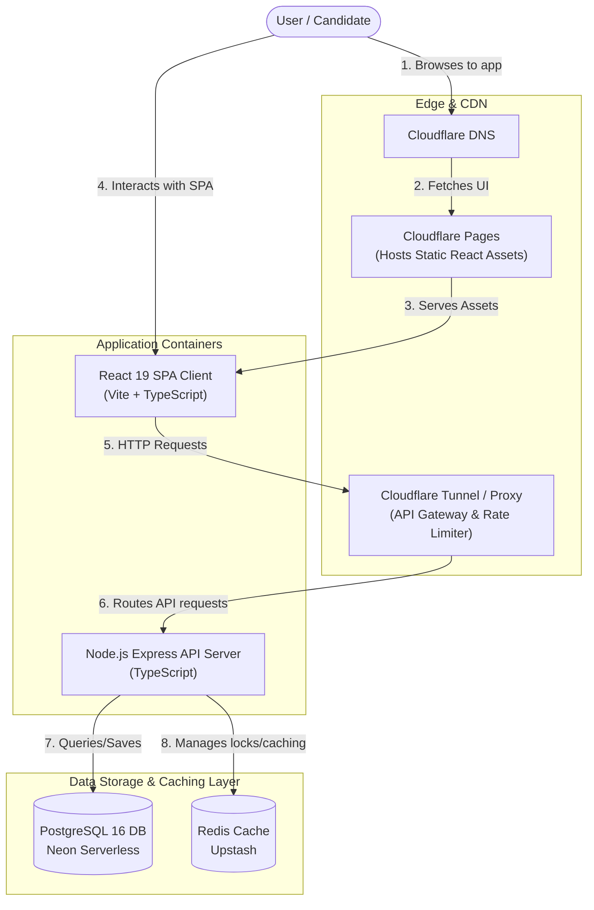

# 01 — System Overview & Architecture Diagram

This document defines the high-level design of the **CareerLift** application. It describes how the single-page application client, the REST API server, and the database/caching layer interact to support the gamified, real-time interview preparation platform.

---

## C4 Container Diagram

The following diagram illustrates the boundaries of the CareerLift system, showing how users interact with the client SPA and how requests route through edge services to the core backend.

---

## Component Map

### 1. Client-Side Components (React SPA)
* **Routing Layer (React Router v7):** Manages user navigation. Guards private routes (e.g., `/dashboard`, `/questions`) to ensure only authenticated users can access them, redirecting anonymous users to `/login`.
* **State Managers:**
  * **Zustand (Client State):** Holds quick-access client states: auth status, user credentials, drafts of unanswered questions, and theme preferences.
  * **TanStack Query (Server State):** Automatically manages caching, background re-validation, and loading/error states for server-side endpoints (questions list, bookmarks, company details).
* **Feature Modules:** Self-contained domains (Auth, Onboarding, Questions, Companies, Streaks, Profile) that contain their own layout and components.

### 2. Server-Side Components (Node.js/Express)
* **Auth Middleware:** Verifies incoming `Authorization: Bearer <JWT>` headers and appends the decrypted user context to the request.
* **Streak Controller:** Integrates timezone data sent by the client to calculate, increment, or reset user streaks during daily task completion checks.
* **Question Engine:** Services the daily question generator, fetching relevant questions depending on the user's career and experience settings.
* **Contribution Processor:** Handles community-submitted interview reports. Validates submissions, structures them against targeted company entities, and awards user points.

### 3. Data Storage Layer
* **PostgreSQL:** Serves as the source of truth for schema data: user details, questions, bookmarks, company databases, and historical contributions.
* **Redis Cache:** Keeps high-frequency key-value records for fast retrieval: user daily streaks, active token blacklists (for logouts), and rate limiter counts.

---

## User Flow Scenarios

### Scenario A: Registration & Onboarding Flow
1. A new user registers via `/register` (data saved to `users` table).
2. The user is redirected to `/onboarding`. They submit career preference (e.g., Frontend Engineer), experience (e.g., Mid), and target daily questions (e.g., 5).
3. The server saves this data into the `onboarding_profiles` table.
4. On success, the user is redirected to `/dashboard`.

### Scenario B: Daily Practice Flow
1. User loads the `/dashboard`. TanStack Query fetches `/api/v1/questions/daily` (returns 5 questions matching their career profile).
2. User selects a question, navigating to `/questions/:id`.
3. User writes a draft answer. The answer is saved locally in Zustand/`localStorage` automatically.
4. User submits the response (saved in the database).
5. The server checks the daily questions count. If the quota is met, the server increments their streak in Redis and the database.
6. The user clicks "Reveal Answer" to compare their output with the community standard and key insights.
