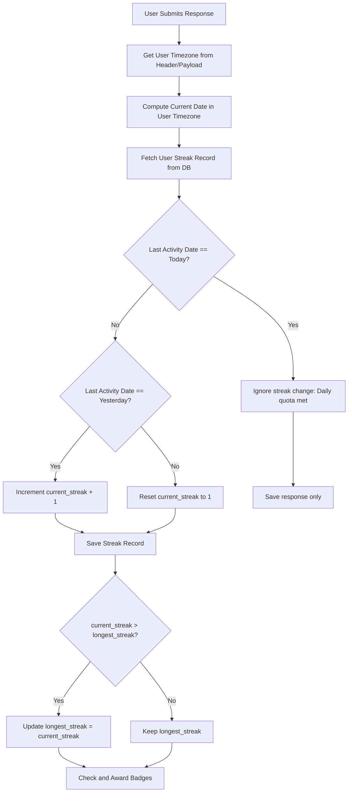

# 06 — Gamification, Streaks & Achievements

A key driver of user engagement on CareerLift is the gamification engine, which is modeled after Duolingo. This document outlines the algorithm for calculating daily streaks across timezones and defines the badge system.

---

## 1. Timezone-Aware Streak Algorithm

A common issue in global applications is "streak breakage" caused by timezone mismatches between the server (usually UTC) and the user's local time. To solve this, CareerLift uses **timezone-aware date tracking**.

### The Flow


---

## 2. Implementation: Node.js Streak Controller

Below is the implementation logic using `date-fns-tz` to handle user-localized dates:

```typescript
import { formatInTimeZone } from 'date-fns-tz';
import { db } from '../../db';
import { streakHistories } from '../../db/schema';
import { eq } from 'drizzle-orm';

interface UpdateStreakParams {
  userId: string;
  userTimezone: string; // e.g., "Africa/Lagos", "America/New_York"
}

export async function processUserStreakUpdate({ userId, userTimezone }: UpdateStreakParams) {
  // 1. Calculate the current localized date for the user
  const userLocalDateStr = formatInTimeZone(new Date(), userTimezone, 'yyyy-MM-dd');
  const today = new Date(userLocalDateStr);

  // 2. Fetch the user's current streak history
  const [history] = await db
    .select()
    .from(streakHistories)
    .where(eq(streakHistories.userId, userId));

  if (!history) {
    // Initial entry
    await db.insert(streakHistories).values({
      userId,
      currentStreak: 1,
      longestStreak: 1,
      lastActivityDate: userLocalDateStr,
      questionsCompletedToday: 1,
    });
    return { currentStreak: 1, dailyQuotaMet: true };
  }

  const lastActivityDateStr = history.lastActivityDate; // string format 'yyyy-MM-dd'
  
  if (lastActivityDateStr === userLocalDateStr) {
    // Already active today. Increment completed questions count.
    const updatedQuestionsCount = history.questionsCompletedToday + 1;
    await db
      .update(streakHistories)
      .set({ 
        questionsCompletedToday: updatedQuestionsCount,
        updatedAt: new Date()
      })
      .where(eq(streakHistories.userId, userId));

    return { 
      currentStreak: history.currentStreak, 
      dailyQuotaMet: true 
    };
  }

  // Calculate the difference in calendar days
  const lastActivity = new Date(lastActivityDateStr);
  const diffTime = Math.abs(today.getTime() - lastActivity.getTime());
  const diffDays = Math.ceil(diffTime / (1000 * 60 * 60 * 24));

  let nextStreak = history.currentStreak;
  let nextLongest = history.longestStreak;

  if (diffDays === 1) {
    // Completed on the consecutive day
    nextStreak += 1;
    if (nextStreak > nextLongest) {
      nextLongest = nextStreak;
    }
  } else {
    // Broke streak (more than 1 day since last activity)
    nextStreak = 1;
  }

  await db
    .update(streakHistories)
    .set({
      currentStreak: nextStreak,
      longestStreak: nextLongest,
      lastActivityDate: userLocalDateStr,
      questionsCompletedToday: 1,
      updatedAt: new Date()
    })
    .where(eq(streakHistories.userId, userId));

  return { 
    currentStreak: nextStreak, 
    dailyQuotaMet: true 
  };
}
```

---

## 3. Achievement Badges System

Badges are awarded asynchronously when a transaction finishes updating user stats. The system checks if the user meets the badge thresholds and inserts a new badge record into the database if they do.

| Badge Type | Unlock Condition | Visual Design Description |
| :--- | :--- | :--- |
| **streak_7** | 7-Day Streak | Fire icon with bronze border |
| **streak_30** | 30-Day Streak | Flame icon with silver border |
| **streak_100** | 100-Day Streak | Crown icon with gold border |
| **questions_100** | 100 Questions Completed | Open book icon with bronze detail |
| **contributions_50** | 50 Interview Reports Submitted | Shield icon representing community support |

### Badge Award Triggers (Middleware/Service Hook)
```typescript
import { db } from '../../db';
import { userBadges } from '../../db/schema';
import { and, eq } from 'drizzle-orm';

export async function verifyAndAwardBadges(userId: string, currentStreak: number, totalQuestions: number, totalContributions: number) {
  const checkAndInsert = async (badgeType: string) => {
    // Avoid duplicates
    const [existing] = await db
      .select()
      .from(userBadges)
      .where(and(eq(userBadges.userId, userId), eq(userBadges.badgeType, badgeType)));

    if (!existing) {
      await db.insert(userBadges).values({
        userId,
        badgeType,
      });
      // Return details to notify the client in the API response
      return true;
    }
    return false;
  };

  const awards: string[] = [];

  if (currentStreak >= 7 && await checkAndInsert('streak_7')) awards.push('streak_7');
  if (currentStreak >= 30 && await checkAndInsert('streak_30')) awards.push('streak_30');
  if (currentStreak >= 100 && await checkAndInsert('streak_100')) awards.push('streak_100');
  if (totalQuestions >= 100 && await checkAndInsert('questions_100')) awards.push('questions_100');
  if (totalContributions >= 50 && await checkAndInsert('contributions_50')) awards.push('contributions_50');

  return awards; // Return newly unlocked badges to show in the UI modal
}
```
