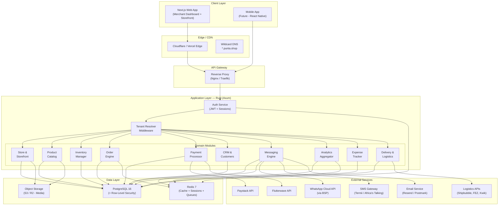
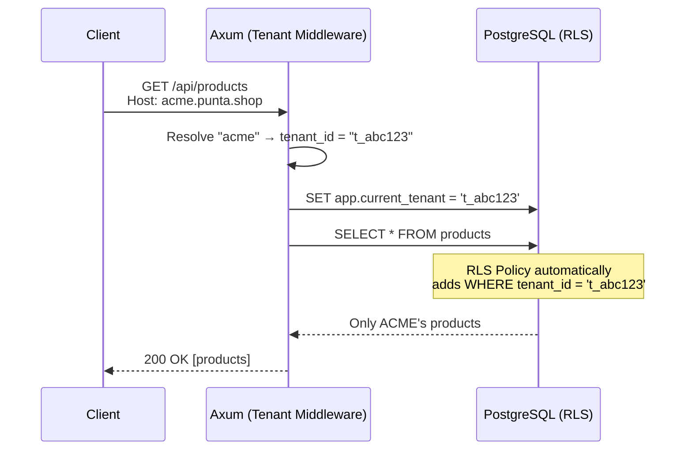
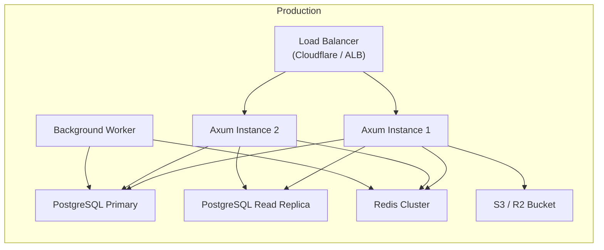

# Punta — Multi-Tenant Business Management SaaS Platform

A Bumpa-inspired platform enabling SMBs to manage their entire business: online store, inventory, customers, payments, social selling, messaging, analytics, expenses, deliveries, and multi-location operations — all from a single dashboard.

## User Review Required

> [!IMPORTANT]
> **Naming:** I've used "Punta" as the project codename (from the workspace folder). Let me know if you have a different name in mind.

> [!IMPORTANT]
> **Payment Gateways:** Which payment providers should we integrate? Options:
> - **Paystack** (dominant in Nigeria, supports cards, bank transfers, USSD)
> - **Flutterwave** (pan-African, multi-currency)
> - **Both** (recommended — let merchants choose)
> - **Stripe** (for international expansion later)

> [!WARNING]
> **WhatsApp Business API:** Requires a Meta Business Solution Provider (BSP) partnership. This has onboarding time and costs. We should decide early whether to:
> - Use a BSP like **Twilio** or **Infobip** (faster, managed)
> - Build direct integration with Meta's Cloud API (more control, more work)

## Open Questions

1. **Target Market:** Nigeria-first (like Bumpa) or pan-African from the start? This affects currency, tax, and compliance modules.
2. **Mobile App:** Is a React Native / Flutter mobile app in scope alongside the Next.js web app, or web-only for now?
3. **POS Integration:** Do we need a physical Point-of-Sale integration (Bluetooth receipt printers, barcode scanners)?
4. **Domain Model:** Should each tenant get a subdomain (`store-name.punta.shop`) or a path-based store (`punta.shop/store-name`)?
5. **Deployment Target:** Cloud provider preference? (AWS, GCP, DigitalOcean, or self-hosted)
6. **Billing Model:** Should we configure default platform transactional commissions (e.g. 1.0% platform fee) and logistics markups globally or dynamically per tenant?

---

## High-Level System Architecture



---

## Technology Stack

| Layer | Technology | Rationale |
|:---|:---|:---|
| **Backend** | Rust + Axum 0.8 | Performance, safety, memory efficiency for multi-tenant SaaS |
| **ORM / Query** | SQLx (compile-time checked queries) | Type-safe SQL, no runtime ORM overhead |
| **Frontend** | Next.js 15 (App Router) | SSR for storefronts, React for merchant dashboard |
| **Database** | PostgreSQL 16 | RLS for multi-tenancy, JSONB for flexible metadata, full-text search |
| **Cache/Queue** | Redis 7 (Valkey compatible) | Session store, cache, pub/sub for real-time, background job queue |
| **Object Storage** | Cloudflare R2 / AWS S3 | Product images, invoices, receipts |
| **Auth** | Custom JWT + refresh tokens (argon2 hashing) | Full control, multi-tenant aware |
| **Background Jobs** | Tokio tasks + Redis-backed queue | Async processing (email, webhooks, analytics aggregation) |
| **Search** | PostgreSQL `tsvector` + `pg_trgm` (→ Meilisearch later) | Product search, customer search |
| **Real-time** | WebSockets via Axum | Live order notifications, dashboard updates |

---

## Rust Workspace Structure

```text
punta/
├── Cargo.toml                    # Workspace root
├── .env.example
├── migrations/                   # SQLx migrations
│   ├── 001_tenants.sql
│   ├── 002_auth.sql
│   ├── 003_products.sql
│   └── ...
│
├── crates/
│   ├── punta-core/               # Shared types, errors, config
│   │   ├── Cargo.toml
│   │   └── src/
│   │       ├── lib.rs
│   │       ├── config.rs         # App configuration (env vars)
│   │       ├── error.rs          # Unified error types (thiserror)
│   │       ├── types.rs          # Common types (Money, Currency, Pagination)
│   │       └── tenant.rs         # TenantId, TenantContext
│   │
│   ├── punta-db/                 # Database layer (SQLx, migrations, RLS helpers)
│   │   ├── Cargo.toml
│   │   └── src/
│   │       ├── lib.rs
│   │       ├── pool.rs           # Connection pool + tenant session setup
│   │       ├── rls.rs            # RLS policy helpers
│   │       └── models/           # DB row types (FromRow)
│   │
│   ├── punta-auth/               # Authentication & authorization
│   │   ├── Cargo.toml
│   │   └── src/
│   │       ├── lib.rs
│   │       ├── jwt.rs            # Token generation & validation
│   │       ├── password.rs       # argon2 hashing
│   │       ├── middleware.rs     # Auth middleware + extractors
│   │       ├── rbac.rs           # Role-based access control
│   │       └── handlers.rs       # Login, register, refresh, forgot-password
│   │
│   ├── punta-tenant/             # Tenant management & multi-tenancy
│   │   ├── Cargo.toml
│   │   └── src/
│   │       ├── lib.rs
│   │       ├── resolver.rs       # Subdomain → tenant resolution middleware
│   │       ├── service.rs        # Tenant CRUD, onboarding
│   │       └── handlers.rs       # API handlers
│   │
│   ├── punta-store/              # Online store & storefront
│   │   ├── Cargo.toml
│   │   └── src/
│   │       ├── lib.rs
│   │       ├── service.rs        # Store settings, themes, domains
│   │       ├── storefront.rs     # Public storefront API (products, cart, checkout)
│   │       └── handlers.rs
│   │
│   ├── punta-catalog/            # Product catalog & categories
│   │   ├── Cargo.toml
│   │   └── src/
│   │       ├── lib.rs
│   │       ├── product.rs        # Product CRUD, variants, pricing
│   │       ├── category.rs       # Category tree
│   │       ├── media.rs          # Image upload & management
│   │       └── handlers.rs
│   │
│   ├── punta-inventory/          # Stock management
│   │   ├── Cargo.toml
│   │   └── src/
│   │       ├── lib.rs
│   │       ├── stock.rs          # Stock levels, adjustments, transfers
│   │       ├── alerts.rs         # Low-stock notifications
│   │       ├── location.rs       # Multi-location stock tracking
│   │       └── handlers.rs
│   │
│   ├── punta-orders/             # Order management
│   │   ├── Cargo.toml
│   │   └── src/
│   │       ├── lib.rs
│   │       ├── order.rs          # Order lifecycle (placed → fulfilled → delivered)
│   │       ├── cart.rs           # Cart management
│   │       ├── checkout.rs       # Checkout flow
│   │       ├── invoice.rs        # Invoice/receipt generation
│   │       └── handlers.rs
│   │
│   ├── punta-payments/           # Payment processing
│   │   ├── Cargo.toml
│   │   └── src/
│   │       ├── lib.rs
│   │       ├── gateway.rs        # Payment gateway trait
│   │       ├── paystack.rs       # Paystack implementation
│   │       ├── flutterwave.rs    # Flutterwave implementation
│   │       ├── wallet.rs         # Merchant wallet & settlements
│   │       ├── webhook.rs        # Payment webhook handlers
│   │       └── handlers.rs
│   │
│   ├── punta-crm/                # Customer relationship management
│   │   ├── Cargo.toml
│   │   └── src/
│   │       ├── lib.rs
│   │       ├── customer.rs       # Customer profiles, notes, tags
│   │       ├── groups.rs         # Customer segmentation
│   │       ├── history.rs        # Purchase history, engagement
│   │       └── handlers.rs
│   │
│   ├── punta-messaging/          # Multi-channel messaging
│   │   ├── Cargo.toml
│   │   └── src/
│   │       ├── lib.rs
│   │       ├── engine.rs         # Unified message dispatcher
│   │       ├── whatsapp.rs       # WhatsApp Cloud API integration
│   │       ├── sms.rs            # SMS gateway integration
│   │       ├── email.rs          # Transactional & marketing emails
│   │       ├── templates.rs      # Message templates & variables
│   │       ├── campaigns.rs      # Bulk campaigns (segmented)
│   │       └── handlers.rs
│   │
│   ├── punta-analytics/          # Business analytics & reporting
│   │   ├── Cargo.toml
│   │   └── src/
│   │       ├── lib.rs
│   │       ├── dashboard.rs      # Dashboard aggregations
│   │       ├── sales.rs          # Sales reports (daily, weekly, monthly)
│   │       ├── products.rs       # Product performance
│   │       ├── customers.rs      # Customer insights
│   │       ├── channels.rs       # Sales channel breakdown
│   │       └── handlers.rs
│   │
│   ├── punta-expenses/           # Expense tracking
│   │   ├── Cargo.toml
│   │   └── src/
│   │       ├── lib.rs
│   │       ├── expense.rs        # Expense CRUD, categories
│   │       ├── recurring.rs      # Recurring expenses
│   │       ├── reports.rs        # P&L, expense summaries
│   │       └── handlers.rs
│   │
│   ├── punta-delivery/           # Delivery & logistics
│   │   ├── Cargo.toml
│   │   └── src/
│   │       ├── lib.rs
│   │       ├── provider.rs       # Logistics provider trait
│   │       ├── shipbubble.rs     # Shipbubble integration
│   │       ├── tracking.rs       # Shipment tracking
│   │       ├── rates.rs          # Shipping rate calculation
│   │       └── handlers.rs
│   │
│   └── punta-jobs/               # Background job processing
│       ├── Cargo.toml
│       └── src/
│           ├── lib.rs
│           ├── worker.rs         # Redis-backed job worker
│           ├── scheduler.rs      # Cron-like scheduled tasks
│           └── jobs/             # Individual job definitions
│               ├── send_notification.rs
│               ├── aggregate_analytics.rs
│               ├── process_webhook.rs
│               └── low_stock_check.rs
│
├── src/                          # Binary entry point
│   └── main.rs                   # Axum app assembly, router merging
│
└── web/                          # Next.js frontend
    ├── package.json
    ├── next.config.ts
    ├── src/
    │   ├── app/
    │   │   ├── (auth)/           # Auth pages (login, register, forgot-password)
    │   │   ├── (dashboard)/      # Merchant dashboard
    │   │   │   ├── layout.tsx
    │   │   │   ├── page.tsx      # Dashboard overview
    │   │   │   ├── products/
    │   │   │   ├── orders/
    │   │   │   ├── customers/
    │   │   │   ├── inventory/
    │   │   │   ├── messaging/
    │   │   │   ├── analytics/
    │   │   │   ├── expenses/
    │   │   │   ├── delivery/
    │   │   │   ├── settings/
    │   │   │   └── store/
    │   │   ├── (storefront)/     # Public-facing store (SSR)
    │   │   │   ├── [store]/      # Dynamic store routes
    │   │   │   │   ├── page.tsx  # Store homepage
    │   │   │   │   ├── products/
    │   │   │   │   ├── cart/
    │   │   │   │   └── checkout/
    │   │   │   └── layout.tsx
    │   │   └── layout.tsx        # Root layout
    │   ├── components/
    │   │   ├── ui/               # Design system components
    │   │   ├── dashboard/        # Dashboard-specific components
    │   │   └── storefront/       # Store-specific components
    │   ├── lib/
    │   │   ├── api.ts            # API client (fetch wrapper)
    │   │   ├── auth.ts           # Auth helpers
    │   │   └── utils.ts
    │   └── styles/
    │       └── globals.css
    └── public/
```

---

## Multi-Tenancy Strategy

### Approach: Shared Schema + PostgreSQL Row-Level Security (RLS)

This is the industry-standard approach for high-scale SaaS. Every tenant's data lives in the same tables but is automatically filtered by `tenant_id` at the database level.

### How It Works



### Key Implementation Details

```sql
-- Every table includes tenant_id
CREATE TABLE products (
    id          UUID PRIMARY KEY DEFAULT gen_random_uuid(),
    tenant_id   UUID NOT NULL REFERENCES tenants(id),
    name        TEXT NOT NULL,
    description TEXT,
    price       BIGINT NOT NULL,  -- stored in kobo/cents
    currency    TEXT NOT NULL DEFAULT 'NGN',
    created_at  TIMESTAMPTZ NOT NULL DEFAULT now(),
    updated_at  TIMESTAMPTZ NOT NULL DEFAULT now()
);

-- Create index on tenant_id for every table
CREATE INDEX idx_products_tenant ON products(tenant_id);

-- Enable RLS
ALTER TABLE products ENABLE ROW LEVEL SECURITY;

-- Policy: tenant can only see their own data
CREATE POLICY tenant_isolation ON products
    USING (tenant_id = current_setting('app.current_tenant')::UUID);

-- Force RLS even for table owners
ALTER TABLE products FORCE ROW LEVEL SECURITY;
```

### Rust Implementation (Tenant Middleware)

```rust
// Simplified tenant resolution middleware for Axum
pub async fn tenant_middleware(
    State(pool): State<PgPool>,
    Host(host): Host,
    mut request: Request,
    next: Next,
) -> Result<Response, AppError> {
    // Extract subdomain: "acme.punta.shop" → "acme"
    let subdomain = extract_subdomain(&host)?;
    
    // Look up tenant (cached in Redis)
    let tenant = resolve_tenant(&pool, &subdomain).await?;
    
    // Inject tenant context into request extensions
    request.extensions_mut().insert(TenantContext {
        id: tenant.id,
        slug: tenant.slug,
        is_active: tenant.is_active,
    });
    
    Ok(next.run(request).await)
}

// Custom extractor for handlers
pub struct Tenant(pub TenantContext);

#[async_trait]
impl<S> FromRequestParts<S> for Tenant {
    type Rejection = AppError;
    
    async fn from_request_parts(parts: &mut Parts, _state: &S) -> Result<Self, Self::Rejection> {
        parts.extensions.get::<TenantContext>()
            .cloned()
            .map(Tenant)
            .ok_or(AppError::TenantNotFound)
    }
}
```

---

## Database Schema Design

### Core Tables

```mermaid
erDiagram
    TENANTS ||--o{ USERS : "has"
    TENANTS ||--o{ STORES : "owns"
    TENANTS ||--o{ PRODUCTS : "has"
    TENANTS ||--o{ CUSTOMERS : "has"
    TENANTS ||--o{ ORDERS : "receives"
    TENANTS ||--o{ LOCATIONS : "operates"

    TENANTS {
        uuid id PK
        uuid slug UK "acme"
        text business_name
        text email
        text phone
        boolean is_active
        jsonb settings
        timestamptz created_at
    }

    USERS {
        uuid id PK
        uuid tenant_id FK
        text email UK
        text password_hash
        text full_name
        text role "owner|admin|staff"
        boolean is_active
        timestamptz last_login
    }

    STORES {
        uuid id PK
        uuid tenant_id FK
        text name
        text subdomain UK
        text custom_domain
        jsonb theme "colors, logo, layout"
        jsonb seo_settings
        boolean is_published
    }

    PRODUCTS {
        uuid id PK
        uuid tenant_id FK
        uuid category_id FK
        text name
        text description
        bigint price "in smallest unit (kobo)"
        text currency
        text sku
        jsonb metadata
        boolean is_active
        text[] tags
        tsvector search_vector
    }

    PRODUCT_VARIANTS {
        uuid id PK
        uuid product_id FK
        uuid tenant_id FK
        text name "e.g. Size: Large"
        bigint price_override
        text sku
        jsonb attributes
    }

    PRODUCT_IMAGES {
        uuid id PK
        uuid product_id FK
        uuid tenant_id FK
        text url
        text alt_text
        integer sort_order
        boolean is_primary
    }

    CATEGORIES {
        uuid id PK
        uuid tenant_id FK
        uuid parent_id FK "self-referencing for tree"
        text name
        text slug
        integer sort_order
    }

    CUSTOMERS {
        uuid id PK
        uuid tenant_id FK
        text first_name
        text last_name
        text email
        text phone
        text whatsapp_number
        jsonb addresses
        text[] tags
        text notes
        bigint total_spent
        integer order_count
        timestamptz last_order_at
    }

    CUSTOMER_GROUPS {
        uuid id PK
        uuid tenant_id FK
        text name
        jsonb filter_criteria "dynamic segmentation rules"
    }

    ORDERS {
        uuid id PK
        uuid tenant_id FK
        uuid customer_id FK
        uuid location_id FK
        text order_number "auto-generated"
        text status "pending|confirmed|processing|shipped|delivered|cancelled"
        text payment_status "unpaid|paid|refunded|partial"
        bigint subtotal
        bigint discount_amount
        bigint shipping_cost
        bigint tax_amount
        bigint total
        text currency
        text channel "web|whatsapp|instagram|pos|manual"
        jsonb shipping_address
        text notes
    }

    ORDER_ITEMS {
        uuid id PK
        uuid order_id FK
        uuid tenant_id FK
        uuid product_id FK
        uuid variant_id FK
        text product_name "snapshot at time of order"
        bigint unit_price
        integer quantity
        bigint total
    }

    PAYMENTS {
        uuid id PK
        uuid tenant_id FK
        uuid order_id FK
        text provider "paystack|flutterwave|bank_transfer|cash"
        text provider_ref "external transaction ref"
        text status "pending|success|failed|refunded"
        bigint amount
        text currency
        jsonb metadata
    }

    INVENTORY {
        uuid id PK
        uuid tenant_id FK
        uuid product_id FK
        uuid variant_id FK
        uuid location_id FK
        integer quantity
        integer reserved "held for pending orders"
        integer reorder_level "low stock threshold"
    }

    INVENTORY_MOVEMENTS {
        uuid id PK
        uuid tenant_id FK
        uuid inventory_id FK
        text movement_type "sale|restock|adjustment|transfer|return"
        integer quantity_change
        text reference "order_id or adjustment note"
        uuid performed_by FK
        timestamptz created_at
    }

    LOCATIONS {
        uuid id PK
        uuid tenant_id FK
        text name "Main Store, Warehouse, etc."
        text type "store|warehouse"
        jsonb address
        boolean is_default
    }

    EXPENSES {
        uuid id PK
        uuid tenant_id FK
        text title
        text category
        bigint amount
        text currency
        date expense_date
        text recurrence "none|daily|weekly|monthly"
        text notes
        text receipt_url
    }

    DELIVERIES {
        uuid id PK
        uuid tenant_id FK
        uuid order_id FK
        text provider "shipbubble|fez|kwik|self"
        text tracking_number
        text status "pending|picked_up|in_transit|delivered|failed"
        bigint cost
        jsonb provider_metadata
    }

    MESSAGE_TEMPLATES {
        uuid id PK
        uuid tenant_id FK
        text name
        text channel "whatsapp|sms|email"
        text subject
        text body "supports {{variables}}"
        text status "draft|approved|rejected"
    }

    MESSAGES {
        uuid id PK
        uuid tenant_id FK
        uuid customer_id FK
        uuid template_id FK
        text channel
        text direction "inbound|outbound"
        text status "queued|sent|delivered|read|failed"
        text body
        jsonb metadata
        timestamptz sent_at
    }

    CAMPAIGNS {
        uuid id PK
        uuid tenant_id FK
        text name
        uuid customer_group_id FK
        uuid template_id FK
        text channel
        text status "draft|scheduled|sending|sent|cancelled"
        integer total_recipients
        integer delivered_count
        integer read_count
        timestamptz scheduled_at
    }

    TENANT_FEATURES {
        uuid id PK
        uuid tenant_id FK
        text feature_key "custom_domain|multi_location"
        timestamptz expires_at
        timestamptz created_at
    }
```



---

## API Design

### Authentication & Tenant APIs

| Method | Endpoint | Description |
|:---|:---|:---|
| POST | `/api/v1/auth/register` | Register new merchant + create tenant |
| POST | `/api/v1/auth/login` | Login (returns JWT + refresh token) |
| POST | `/api/v1/auth/refresh` | Refresh access token |
| POST | `/api/v1/auth/forgot-password` | Send password reset email |
| POST | `/api/v1/auth/reset-password` | Reset password with token |
| GET | `/api/v1/tenant` | Get current tenant info |
| PATCH | `/api/v1/tenant` | Update tenant settings |
| POST | `/api/v1/tenant/staff` | Invite staff member |

### Product & Catalog APIs

| Method | Endpoint | Description |
|:---|:---|:---|
| GET | `/api/v1/products` | List products (paginated, filterable) |
| POST | `/api/v1/products` | Create product |
| GET | `/api/v1/products/:id` | Get product detail |
| PATCH | `/api/v1/products/:id` | Update product |
| DELETE | `/api/v1/products/:id` | Soft-delete product |
| POST | `/api/v1/products/:id/variants` | Add variant |
| POST | `/api/v1/products/:id/images` | Upload images |
| GET | `/api/v1/categories` | List categories (tree) |
| POST | `/api/v1/categories` | Create category |

### Order & Checkout APIs

| Method | Endpoint | Description |
|:---|:---|:---|
| GET | `/api/v1/orders` | List orders (filterable by status, date, channel) |
| POST | `/api/v1/orders` | Create manual order |
| GET | `/api/v1/orders/:id` | Get order detail |
| PATCH | `/api/v1/orders/:id/status` | Update order status |
| POST | `/api/v1/orders/:id/invoice` | Generate invoice PDF |
| **Storefront (public)** | | |
| POST | `/api/v1/storefront/:store/cart` | Add to cart |
| GET | `/api/v1/storefront/:store/cart` | View cart |
| POST | `/api/v1/storefront/:store/checkout` | Initiate checkout |

### Payment APIs

| Method | Endpoint | Description |
|:---|:---|:---|
| POST | `/api/v1/payments/initialize` | Initialize payment (returns gateway URL) |
| POST | `/api/v1/webhooks/paystack` | Paystack webhook handler |
| POST | `/api/v1/webhooks/flutterwave` | Flutterwave webhook handler |
| GET | `/api/v1/wallet` | Merchant wallet balance |
| POST | `/api/v1/wallet/withdraw` | Request withdrawal |

### Customer & CRM APIs

| Method | Endpoint | Description |
|:---|:---|:---|
| GET | `/api/v1/customers` | List customers (search, filter, paginate) |
| POST | `/api/v1/customers` | Create customer |
| GET | `/api/v1/customers/:id` | Customer profile (with order history) |
| PATCH | `/api/v1/customers/:id` | Update customer |
| GET | `/api/v1/customer-groups` | List customer groups |
| POST | `/api/v1/customer-groups` | Create segment |

### Messaging APIs

| Method | Endpoint | Description |
|:---|:---|:---|
| POST | `/api/v1/messages/send` | Send single message (any channel) |
| POST | `/api/v1/campaigns` | Create & schedule campaign |
| GET | `/api/v1/campaigns` | List campaigns |
| GET | `/api/v1/message-templates` | List templates |
| POST | `/api/v1/message-templates` | Create template |
| POST | `/api/v1/webhooks/whatsapp` | WhatsApp webhook (inbound messages) |

### Inventory APIs

| Method | Endpoint | Description |
|:---|:---|:---|
| GET | `/api/v1/inventory` | Stock levels (by product/location) |
| POST | `/api/v1/inventory/adjust` | Manual stock adjustment |
| POST | `/api/v1/inventory/transfer` | Transfer between locations |
| GET | `/api/v1/inventory/alerts` | Low-stock alerts |
| GET | `/api/v1/locations` | List locations/branches |
| POST | `/api/v1/locations` | Create location |

### Analytics APIs

| Method | Endpoint | Description |
|:---|:---|:---|
| GET | `/api/v1/analytics/dashboard` | Overview metrics (sales, orders, customers) |
| GET | `/api/v1/analytics/sales` | Sales breakdown (by period, channel, product) |
| GET | `/api/v1/analytics/products` | Product performance |
| GET | `/api/v1/analytics/customers` | Customer insights |

### Delivery APIs

| Method | Endpoint | Description |
|:---|:---|:---|
| POST | `/api/v1/deliveries/rates` | Get shipping rate quotes |
| POST | `/api/v1/deliveries` | Book delivery |
| GET | `/api/v1/deliveries/:id/track` | Track shipment |
| POST | `/api/v1/webhooks/delivery` | Delivery status webhook |

### Expense APIs

| Method | Endpoint | Description |
|:---|:---|:---|
| GET | `/api/v1/expenses` | List expenses (filterable) |
| POST | `/api/v1/expenses` | Create expense |
| GET | `/api/v1/expenses/summary` | Expense summary & P/L report |

---

## Key Architectural Decisions

### 1. Money Handling
- All monetary values stored as `BIGINT` in the **smallest currency unit** (kobo for NGN, cents for USD)
- Currency stored alongside every monetary field
- Arithmetic done in integers to avoid floating-point issues
- Display formatting happens in the frontend

### 2. Event-Driven Architecture (Internal)
Key actions emit events via Redis pub/sub for decoupled side-effects:

```text
order.created       → Update inventory, send confirmation, update analytics
order.paid          → Update payment status, send receipt, trigger delivery
order.shipped       → Send tracking notification
payment.received    → Credit merchant wallet
stock.low           → Send alert to merchant
customer.created    → Update CRM analytics
```

### 3. Rate Limiting & Feature Enforcement
- Redis-backed rate limiter per tenant
- Middleware checks wallet balances (e.g., block campaigns if balance < ₦0) and verified add-on unlocks (e.g., custom domains, multi-location)
- Returns `429 Too Many Requests` or `403 Forbidden`

### 4. File Uploads
- Images uploaded directly to S3/R2 via **presigned URLs** (bypass backend for large files)
- Backend generates the presigned URL, frontend uploads directly
- On completion, frontend notifies backend with the object key

### 5. Search
- Phase 1: PostgreSQL full-text search (`tsvector` + `GIN` index) — sufficient for thousands of products
- Phase 2: Meilisearch for advanced faceted search if needed at scale

---

## Infrastructure & Deployment



### Suggested Infrastructure
| Component | Recommendation |
|:---|:---|
| **Compute** | Docker containers on AWS ECS / Fly.io / Railway |
| **Database** | Managed PostgreSQL (Neon, Supabase, or RDS) |
| **Redis** | Managed Redis (Upstash, ElastiCache) |
| **Storage** | Cloudflare R2 (zero egress cost) |
| **CDN** | Cloudflare (also handles wildcard DNS for tenant subdomains) |
| **CI/CD** | GitHub Actions → Docker build → deploy |
| **Monitoring** | Grafana + Prometheus (or Datadog) |
| **Logging** | Structured JSON logs → Loki or CloudWatch |

---

## Phased Delivery Roadmap

### Phase 1 — Foundation (Weeks 1-3)
- [ ] Rust workspace setup with Cargo.toml
- [ ] PostgreSQL schema + migrations (tenants, users, auth)
- [ ] Auth system (register, login, JWT, refresh tokens)
- [ ] Tenant resolution middleware + RLS enforcement
- [ ] Next.js project setup with design system
- [ ] Auth pages (login, register, forgot password)
- [ ] Basic dashboard layout with navigation

### Phase 2 — Core Commerce (Weeks 4-6)
- [ ] Product catalog (CRUD, variants, images, categories)
- [ ] Inventory management (stock tracking, multi-location)
- [ ] Order engine (create, status lifecycle, order items)
- [ ] Cart & checkout flow (storefront API)
- [ ] Payment gateway integration (Paystack + Flutterwave)
- [ ] Invoice/receipt generation
- [ ] Dashboard pages: Products, Orders, Inventory

### Phase 3 — CRM & Messaging (Weeks 7-8)
- [ ] Customer management (profiles, tags, groups, segmentation)
- [ ] WhatsApp Business API integration
- [ ] SMS gateway integration (Termii)
- [ ] Email service integration (Resend)
- [ ] Message templates & campaign engine
- [ ] Dashboard pages: Customers, Messaging

### Phase 4 — Analytics, Expenses & Delivery (Weeks 9-10)
- [ ] Analytics aggregation (sales, products, customers, channels)
- [ ] Expense tracking (CRUD, categories, recurring)
- [ ] Logistics provider integration (Shipbubble)
- [ ] Delivery tracking & notifications
- [ ] Dashboard pages: Analytics, Expenses, Deliveries

### Phase 5 — Storefront & Polish (Weeks 11-12)
- [ ] Public storefront (SSR with Next.js)
- [ ] Store theming & customization
- [ ] Custom domain support
- [ ] Multi-store / multi-branch management
- [ ] Wallet ledger transactions & pay-as-you-go billing
- [ ] Performance optimization & load testing

### Phase 6 — Advanced Features (Weeks 13+)
- [ ] Social commerce channels (Instagram, WhatsApp catalog)
- [ ] POS integration
- [ ] Mobile app (React Native)
- [ ] Advanced analytics (cohort analysis, forecasting)
- [ ] API for third-party integrations
- [ ] Tax compliance modules (VAT, stamp duty)

---

## Verification Plan

### Automated Tests
- **Unit tests:** Each Rust crate has `#[cfg(test)]` modules — run via `cargo test`
- **Integration tests:** SQLx with test database + fixtures — test RLS isolation, order flows, payment webhooks
- **API tests:** HTTP-level tests using `axum::test` or a `reqwest` test client
- **Frontend tests:** Playwright for E2E flows (register → create product → place order → fulfill)
- **Cross-tenant isolation test:** Explicitly verify Tenant A cannot access Tenant B's data

### Manual Verification
- Deploy to staging environment
- Full merchant onboarding flow walkthrough
- Place test orders with Paystack test keys
- Verify WhatsApp message delivery (sandbox)
- Load test with multiple concurrent tenants
